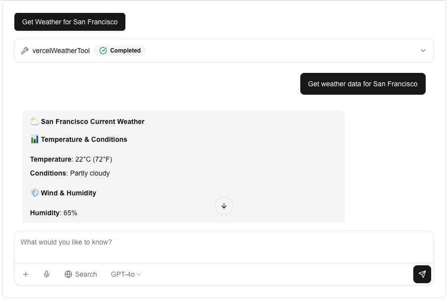

# Mastra + AI SDK v5 Example

This example demonstrates how to integrate [Mastra](https://mastra.ai) with [AI SDK v5](https://sdk.vercel.ai/) in a Next.js application. It showcases a weather agent with real-time chat capabilities, persistent memory, and tool integration.

## Features

- **Real-time Chat Interface**: Uses AI SDK v5's `useChat` hook for streaming conversations
- **Weather Agent**: Intelligent agent powered by OpenAI's GPT-4o that provides weather information
- **Tool Integration**: Custom weather tool that fetches real-time data from Open-Meteo API
- **Persistent Memory**: Conversation history stored using LibSQL with Mastra Memory
- **Modern UI**: Clean chat interface built with Tailwind CSS
- **Full-stack Setup**: Complete Next.js application with API routes
- **PPTX Analysis**: PowerPoint file analysis using Claude AI to extract summaries, key points, and image descriptions

## Demo



*The weather agent in action - providing real-time weather information for San Francisco with temperature, conditions, and humidity data displayed in a clean chat interface.*

## What You'll Learn

- How to set up Mastra agents with AI SDK v5 compatibility
- Creating custom tools for external API integration
- Implementing persistent conversation memory
- Building streaming chat interfaces with Next.js
- Integrating Mastra with modern React patterns

## Getting Started

### Prerequisites

- Node.js 18+

### Installation

1. Install dependencies:

```bash
npm install
```

2. Start the development server:

```bash
npm dev
```

3. Open [http://localhost:3000](http://localhost:3000) to see the chat interface

### Environment Setup

The example uses OpenAI's GPT-4o model. Make sure to set your OpenAI API key:

```bash
# Create a .env.local file
echo "OPENAI_API_KEY=your_openai_api_key_here" > .env.local
```

## How It Works

### Mastra Configuration

The application is configured with a weather agent that:

- Uses OpenAI's GPT-4o model for natural language processing
- Has access to a weather tool for fetching real-time weather data
- Maintains conversation memory using LibSQL storage
- Provides helpful, conversational weather assistance

### AI SDK v5 Integration

The example shows how to:

- Use Mastra agents with AI SDK v5's streaming responses
- Convert Mastra's streaming format to AI SDK v5 compatible streams
- Maintain conversation state across requests
- Load initial conversation history from Mastra Memory

### Key Components

- **`/app/page.tsx`**: React chat interface using `useChat` hook
- **`/app/api/chat/route.ts`**: Streaming chat endpoint with Mastra agent
- **`/app/api/initial-chat/route.ts`**: Loads conversation history from memory
- **`/src/mastra/`**: Mastra configuration, agents, and tools

## Try It Out

Ask the weather agent questions like:

- "What's the weather in San Francisco?"
- "How's the weather in Tokyo today?"
- "Tell me about the conditions in London"

The agent will use its weather tool to fetch real-time data and provide detailed weather information including temperature, humidity, wind conditions, and more.

## PPTX Analysis Feature

This application includes a PowerPoint (PPTX) file analysis feature that converts PPTX files to images and uses Claude AI to analyze the content.

### How It Works

1. **PPTX to PDF Conversion**: Uses LibreOffice to convert PPTX files to PDF format
2. **PDF to Images**: Uses ImageMagick to convert each PDF page (slide) to PNG images
3. **AI Analysis**: Sends slide images to Claude AI (via AWS Bedrock) for content analysis
4. **Structured Output**: Returns summaries, key points, and detailed image descriptions

### Local Development Dependencies

To use the PPTX analysis feature locally, you need to install the following dependencies:

#### macOS

```bash
# Install LibreOffice
brew install --cask libreoffice

# Install ImageMagick
brew install imagemagick
```

#### Linux (Ubuntu/Debian)

```bash
# Install LibreOffice
sudo apt-get update
sudo apt-get install -y libreoffice

# Install ImageMagick and Ghostscript
sudo apt-get install -y imagemagick ghostscript
```

### Docker Deployment

This project includes a production-ready multi-stage Dockerfile optimized for Next.js standalone output mode.

#### Building and Running with Docker

```bash
# Build the Docker image
docker build -t mastra-aisdk5 .

# Run the container
docker run -p 3000:3000 \
  -e OPENAI_API_KEY=your_key_here \
  mastra-aisdk5
```

#### Dockerfile Features

- **Multi-stage build**: Optimized for build caching and smaller image size
- **Node.js 24**: Latest LTS version
- **Standalone output**: Uses Next.js standalone mode for minimal production builds
- **PPTX dependencies**: Includes LibreOffice, ImageMagick, and Ghostscript
- **Security**: Runs as non-root user (`node`)
- **Health check**: Built-in health monitoring for container orchestration

**Important Notes**:
- The project is configured with `output: 'standalone'` in `next.config.ts` (required for Docker)
- ImageMagick's PDF security policy is automatically relaxed for PPTX processing
- The Dockerfile uses `/tmp` for temporary file storage (compatible with ECS Fargate)

### ECS Fargate Deployment

When deploying to AWS ECS Fargate, there are important filesystem permission considerations:

#### File System Configuration

The PPTX converter uses `/tmp` directory for temporary file storage. For proper operation in ECS Fargate:

**ECS Task Definition (Terraform)**:

```hcl
resource "aws_ecs_task_definition" "main" {
  container_definitions = jsonencode([{
    # Disable readonly root filesystem to allow /tmp writes
    readonlyRootFilesystem = false
    essential              = true

    # No need for explicit /tmp volume mount
    # mountPoints = []
  }])

  # No need for explicit volume definition
  # volume { name = "tmp" }
}
```

**Why `readonlyRootFilesystem = false`?**

- The PPTX converter needs to create temporary directories in `/tmp` for file processing
- With `readonlyRootFilesystem = true`, the filesystem becomes read-only, preventing necessary write operations
- This is a common configuration for Next.js applications and is acceptable when:
  - IAM roles are properly configured with least-privilege access
  - Network security groups are properly configured
  - Application code is trusted and doesn't perform unintended file writes

**Security Considerations**:

- Write access is limited to `/tmp` directory by application design
- ECS task execution role should follow least-privilege principles
- Network access should be controlled via security groups
- This configuration is widely used in production Next.js deployments

### Accessing the PPTX Analysis Feature

1. Navigate to [http://localhost:3000/pptx](http://localhost:3000/pptx)
2. Upload a PowerPoint (.pptx) file
3. Click "PPTX解析" to analyze the file
4. View the analysis results including:
   - Overall summary
   - Key points
   - Detailed image descriptions
   - Slide count

## Learn More

- [Mastra Documentation](https://docs.mastra.ai) - Learn about Mastra's features and capabilities
- [AI SDK Documentation](https://sdk.vercel.ai) - Explore AI SDK v5 features
