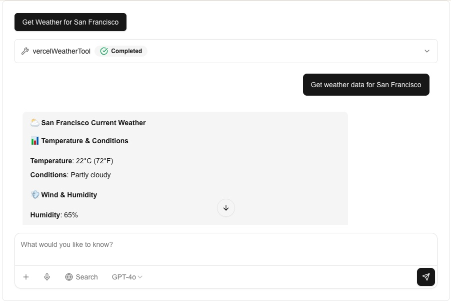

# Mastra + AI SDK v5 Example

This example demonstrates how to integrate [Mastra](https://mastra.ai) with [AI SDK v5](https://sdk.vercel.ai/) in a Next.js application. It showcases a weather agent with real-time chat capabilities, persistent memory, and tool integration.

## Features

- **Real-time Chat Interface**: Uses AI SDK v5's `useChat` hook for streaming conversations
- **Weather Agent**: Intelligent agent powered by OpenAI's GPT-4o that provides weather information
- **Tool Integration**: Custom weather tool that fetches real-time data from Open-Meteo API
- **Persistent Memory**: Conversation history stored using LibSQL with Mastra Memory
- **Modern UI**: Clean chat interface built with Tailwind CSS
- **Full-stack Setup**: Complete Next.js application with API routes

## Demo



*The weather agent in action - providing real-time weather information for San Francisco with temperature, conditions, and humidity data displayed in a clean chat interface.*

## What You'll Learn

- How to set up Mastra agents with AI SDK v5 compatibility
- Creating custom tools for external API integration
- Implementing persistent conversation memory
- Building streaming chat interfaces with Next.js
- Integrating Mastra with modern React patterns

## Getting Started

### Prerequisites

- Node.js 18+

### Installation

1. Install dependencies:

```bash
npm install
```

2. Start the development server:

```bash
npm dev
```

3. Open [http://localhost:3000](http://localhost:3000) to see the chat interface

### Environment Setup

The example uses OpenAI's GPT-4o model. Make sure to set your OpenAI API key:

```bash
# Create a .env.local file
echo "OPENAI_API_KEY=your_openai_api_key_here" > .env.local
```

## How It Works

### Mastra Configuration

The application is configured with a weather agent that:

- Uses OpenAI's GPT-4o model for natural language processing
- Has access to a weather tool for fetching real-time weather data
- Maintains conversation memory using LibSQL storage
- Provides helpful, conversational weather assistance

### AI SDK v5 Integration

The example shows how to:

- Use Mastra agents with AI SDK v5's streaming responses
- Convert Mastra's streaming format to AI SDK v5 compatible streams
- Maintain conversation state across requests
- Load initial conversation history from Mastra Memory

### Key Components

- **`/app/page.tsx`**: React chat interface using `useChat` hook
- **`/app/api/chat/route.ts`**: Streaming chat endpoint with Mastra agent
- **`/app/api/initial-chat/route.ts`**: Loads conversation history from memory
- **`/src/mastra/`**: Mastra configuration, agents, and tools

## Try It Out

Ask the weather agent questions like:

- "What's the weather in San Francisco?"
- "How's the weather in Tokyo today?"
- "Tell me about the conditions in London"

The agent will use its weather tool to fetch real-time data and provide detailed weather information including temperature, humidity, wind conditions, and more.

## Learn More

- [Mastra Documentation](https://docs.mastra.ai) - Learn about Mastra's features and capabilities
- [AI SDK Documentation](https://sdk.vercel.ai) - Explore AI SDK v5 features
